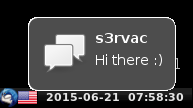

weechat-notify-send
===================

[](https://travis-ci.com/s3rvac/weechat-notify-send)
[](https://coveralls.io/github/s3rvac/weechat-notify-send?branch=master)

A [WeeChat](https://weechat.org/) script that sends highlight and message
notifications through
[notify-send](http://manpages.ubuntu.com/manpages/vivid/man1/notify-send.1.html).
It requires [libnotify](https://developer.gnome.org/libnotify/), which provides
the `notify-send` application.



Note that the exact appearance depends on the configuration of your
notification system as well as on the used icon.

Requirements
------------

* Python 2.7 or Python >= 3.5 (either CPython or PyPy)
* `notify-send` provided by [libnotify](https://developer.gnome.org/libnotify/)
    * Debian: [libnotify-bin](https://packages.debian.org/stretch/libnotify-bin)
    * Ubuntu: [libnotify-bin](https://packages.ubuntu.com/bionic/libnotify-bin)
    * Arch Linux: [extra/libnotify](https://www.archlinux.org/packages/extra/x86_64/libnotify/)

Installation
------------

* Put the
  [`notify_send.py`](https://raw.githubusercontent.com/s3rvac/weechat-notify-send/master/notify_send.py)
  script to `~/.weechat/python/`.
* Add a symbolic link to it in the `~/.weechat/python/autoload/` directory
  to make the script load automatically when WeeChat starts:

    ```
    $ cd ~/.weechat/python/autoload
    $ ln -s ../notify_send.py
    ```

Options
-------

The script allows you to set the following options, either by running `/set
plugins.var.python.notify_send.XXX YYY` or by using the
[iset.pl](https://weechat.org/scripts/source/iset.pl.html/) script.

* `notify_on_highlights`. Send notifications on highlights. Default: `on`.
* `notify_on_privmsgs`. Send notifications on private messages. Default: `on`.
* `notify_on_filtered_messages`. Send notifications also on filtered (hidden)
  messages. Default: `off`.
* `notify_when_away`: Send also notifications when away. Default: `on`.
* `notify_for_current_buffer`: Send also notifications for the currently active
  buffer. Default: `on`.
* `notify_on_all_messages_in_current_buffer`: Send a notification on all
  messages in the currently active buffer. Default: `off`.
* `notify_on_all_messages_in_buffers`: A comma-separated list of buffers for
  which you want to receive notifications on all messages that appear in them.
  You can use either short names (`#buffer`) or full names (`network.#buffer`).
  Default: `''`.
* `notify_on_all_messages_in_buffers_that_match`: A comma-separated list of
  regex patterns of buffers for which you want to receive notifications on all
  messages that appear in them. The matching is done via
  [`re.search()`](https://docs.python.org/3/library/re.html#re.search).
  Default: `''`.
* `notify_on_messages_that_match`: A comma-separated list of regex patterns for
  which you want to receive notifications for any message that matches
  the given regular expression. The matching is done via
  [`re.search()`](https://docs.python.org/3/library/re.html#re.search).
  Default: `''`.
* `min_notification_delay`. A minimal delay in milliseconds between successive
  notifications from the same buffer. It is used to protect from floods/spam.
  Set it to `0` to disable this feature (i.e. all notifications will be shown).
  Default: `500` milliseconds.
* `ignore_messages_tagged_with`: A comma-separated list of message tags for
  which no notifications should be shown. Default:
  `'notify_none,irc_join,irc_quit,irc_part,irc_status,irc_nick_back,irc_401,irc_402'`.
* `ignore_buffers`: A comma-separated list of buffers from which no
  notifications should be shown. You can use either short names (`#buffer`) or
  full names (`network.#buffer`). Default: `''`.
* `ignore_buffers_starting_with`: A comma-separated list of buffer prefixes
  from which no notifications should be shown. Default: `''`.
* `ignore_nicks`: A comma-separated list of nicks from which no notifications
  should be shown. Default: `'-,--,-->'`.
* `ignore_nicks_starting_with`: A comma-separated list of nick prefixes from
  which no notifications should be shown. Default: `''`.
* `hide_messages_in_buffers_that_match`: A comma-separated list of regex
  patterns for names of buffers from which you want to receive notifications
  without messages. Default: `''`.
* `nick_separator`: A separator to be put between a nick and a message.
  Default: `: `.
* `escape_html`: Escapes the `<`, `>`, and `&` HTML
  characters in notification messages. Default: `on`.
* `max_length`: The maximal length of a notification (0 means no limit).
  Default: 72.
* `ellipsis`: An ellipsis to be used for notifications that are too long.
  Default: `[..]`.
* `icon`: A path to an icon to be shown in notifications. Default:
  `/usr/share/icons/hicolor/32x32/apps/weechat.png`.
* `desktop_entry`: Name of the desktop entry for WeeChat. Default: `weechat`.
* `timeout`: Time after which the notification disappears (in milliseconds).
  Set it to 0 to disable the timeout. Default: 5000 (5 seconds).
* `transient`: When a notification expires or is dismissed, remove it from the
  notification bar. Set it to `off` to keep the notification. Default: `on`.
* `urgency`: Notification urgency (`low`, `normal`, `critical`). Default:
  `normal`.

License
-------

Copyright (c) 2015 Petr Zemek (s3rvac@gmail.com) and contributors.

Distributed under the MIT license. See the
[`LICENSE`](https://github.com/s3rvac/weechat-notify-send/blob/master/LICENSE)
file for more details.
